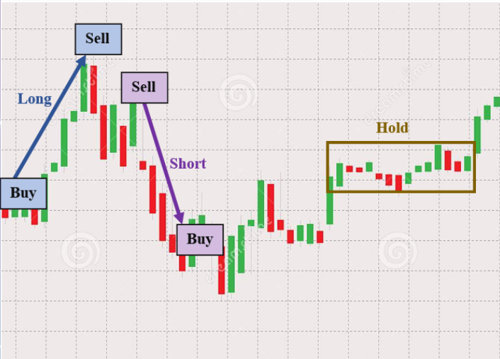
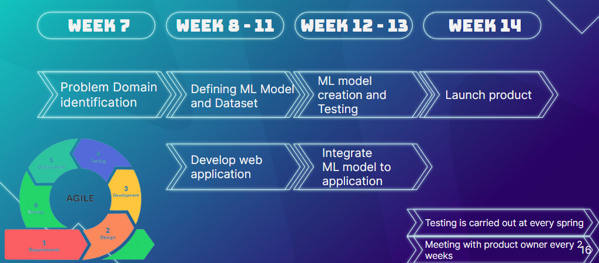

# Stock Mentor

---

## Team
-  E/18/013, Abhilash R., [email](mailto:e18013@eng.pdn.ac.lk)
-  E/18/058, De Alwis K. K. M., [email](mailto:e18058@eng.pdn.ac.lk)
-  E/18/115, Gowsigan A., [email](mailto:e18115@eng.pdn.ac.lk)

## Table of Contents
1. [Background](#backgroung)
2. [Problem](#problem)
3. [Solution](#solution)
4. [Impact](#impact)
5. [User view](#user_view)
6. [Timeline](#timeline)
7. [Links](#links)

---

## Background

According to the above image in the stock market when a person;
                    - buy stocks for a lower price and sell it to a higher price = Long ,
                    - sell stocks for a higher price first and then buy stocks for a lower price = Shorts,
                    - not buying or selling stocks = hold
 
## Problem

In stock market investors buy, sell or, hold data on daily basis.
        - Investors engage in daily buying, selling, or holding of stock market data.
        - Predicting market movements accurately is challenging, leading to potential losses and risk.
        - Investors should conduct thorough research and seek professional advice before making investment decisions.

## Solution

Developing a web application specifically designed to provide investors with recommendations on stock trading decisions for different companies. The application will offer daily suggestions on whether to buy, sell, or hold stocks, assisting investors in making informed choices. By leveraging this application, investors can gain valuable insights to navigate the dynamic stock market effectively.

Following are the facts that were taken into consideration when designing the solution

1. Classification

   Three key categories
    - Long
    - Hold
    - Short
  
2. Imbalanced data

   An imbalanced data set refers to a dataset where the distribution of classes or labels is heavily skewed.

## Impact

There are hundreds of models available, but unfortunately, more than 70% of them make incorrect predictions for the stock market. This is primarily because these models are solely based on software knowledge without considering the crucial aspect of business knowledge. However, our application will stand out by incorporating the business ideas from the project owner, resulting in higher accuracy and a greater impact.

1. Investor Confidence: Accurate predictions can enhance investor confidence in the stock market. If investors have access to reliable predictions of hold, buy, or sell periods, they may make more informed decisions, leading to increased participation and potentially higher trading volumes.

2. Increased accuracy in trading decisions refers to the potential for algorithmic trading systems to make more precise and data-driven choices when executing trades

## User view

## Timeline

## Links

- [Project Repository](https://github.com/cepdnaclk/{{ page.repository-name }}){:target="_blank"}
- [Project Page](https://cepdnaclk.github.io/{{ page.repository-name}}){:target="_blank"}
- [Department of Computer Engineering](http://www.ce.pdn.ac.lk/)
- [University of Peradeniya](https://eng.pdn.ac.lk/)

[//]: # (Please refer this to learn more about Markdown syntax)
[//]: # (https://github.com/adam-p/markdown-here/wiki/Markdown-Cheatsheet)
